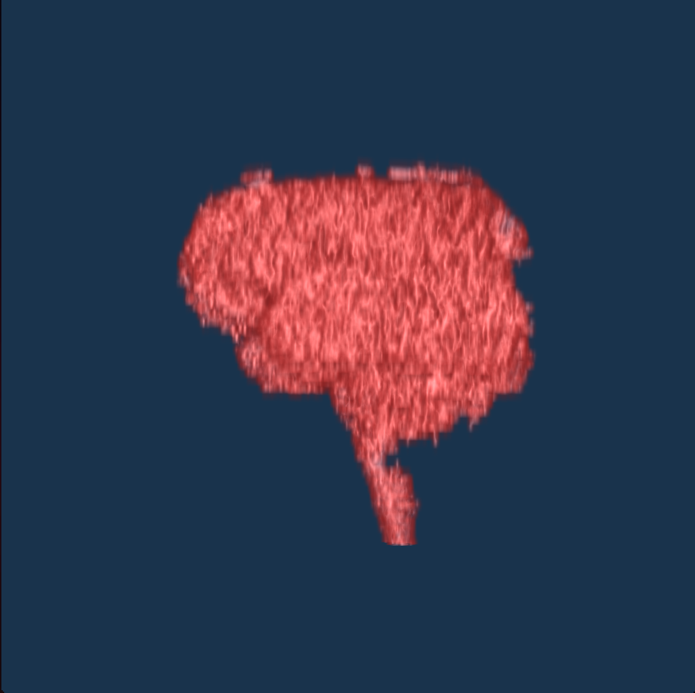

A small application to view DICOM image scans as 3D models, written in C++ with ITK, VTK, and QT. 

This is my semester project for CSC 621 at San Francisco State University

Installation: 

This project relies on ITK, VTK, and QT, all of which must be downloaded and compiled separately.

As someone who has been spoiled by package managers, compiling software from source is frequently a source of frustration for me. I have written this installation guide so as to make the process of installing and compiling DICOMViewer to be as painless as possible--if you run into any difficulties, please let me know! 

Since we're going to be compiling code, we want CMake. CMake is a compilation tool for C and C++. It's easy to install with brew: `brew install cmake`. Done. 

VTK is similarly easy to install--just run `brew install vtk`. 

Next we need to download and compile ITK. Download ITK from their website, create a new directory where the ITK binaries will live (I recommend /usr/local/opt or /usr/local/bin on macOS), navigate there, and run `cmake <path/to/downloaded/ITK/folder> -D CMAKE_CXX_FLAGS=-std=c++11`. The -D option is a fix I found in [this forum post](https://discourse.itk.org/t/visibility-settings/596) for an issue I ran into using ITK with C++ 11 on macOS. 

There should now be a variety of files within the current directory, but no itk binary. This is expected. 

Run `make`, and go get a cup of coffee. No, really--this will take a while. 

When it's done, run `make install`. 

When `make install1` completes, ITK has been completely installed! If you want to test to make sure, check out [this guide](https://itk.org/Wiki/ITK/HelloInsight) for a "Hello World" program for ITK. 

Now that we're done with all that, let's get to installing the actual project. 

Clone this project, and DON'T navigate to the directory that results. `ls` should show you the recently cloned project root folder. `mkdir` a new directory named whatever you want, which will contain the binary files of this project. `cd` into that directory, run `cmake ../DICOMViewer && make`, and wait for the compilation to complete. 

**Project Structure:**

This project is largely modeled after the graduate thesis “3D VISUALIZATION AND SEGMENTATION OF LUNGS USING ITK/VTK/QT FRAMEWORK,”
by Shuaibu Ali Gombe, grad student at Tallinn University of Technology School of Information Technologies, Estonia.

Without referring to his work as guidance, this project would not have been possible.

The project has all of the relevant .cpp and CMakeLists.txt files within a directory managed under git version control, 
with a separate build directory directory **outside of version control** which contains the executables, header files of the libraries to be included,
and files generated during the build process.

The `dicomSeries` class reads, edits, and stores DICOM image files.

The `itkToVtkBridge` class scales and casts pixel intensity values between ITK and VTK acceptable values, then applies
a provided connector function designed specifically for interactions between these two libraries.

The `vtkDicomRenderer` class renders Dicom files using the VTK library.

**Known Issues:**

This project does not read the DICOM headers to retrieve slice order, nor does it adequately identify ROI. These basic
features would be the first goals if work on this project were to continue, unfortunately work on this project has been
discontinued for now.

